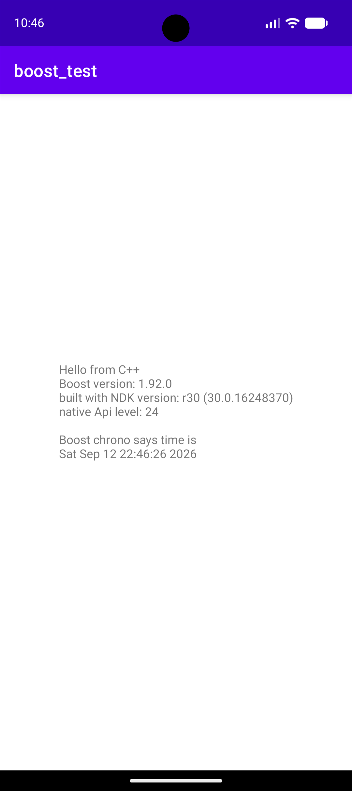

If you build and run this example app it should show the date and time as calculated by boost *chrono*  (indicating that you have built, linked to and called the boost library correctly).
Make sure to adjust the values in the [local.properties](./local.properties) file.

